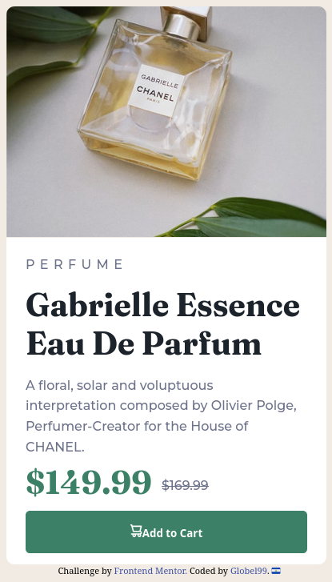
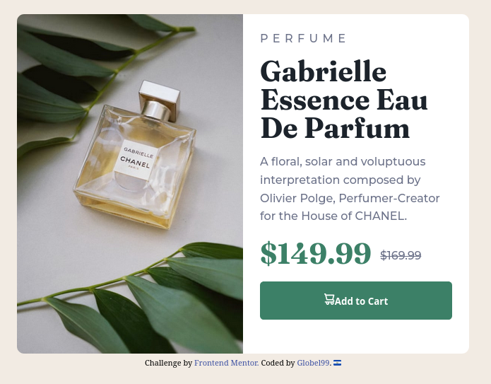

# Frontend Mentor - Product preview card component solution

This is a solution to the [Product preview card component challenge on Frontend Mentor](https://www.frontendmentor.io/challenges/product-preview-card-component-GO7UmttRfa). Frontend Mentor challenges help you improve your coding skills by building realistic projects. 

## Table of contents

- [Overview](#overview)
  - [The challenge](#the-challenge)
  - [Screenshot](#screenshot)
  - [Links](#links)
- [My process](#my-process)
  - [Built with](#built-with)
  - [What I learned](#what-i-learned)
  - [Continued development](#continued-development)
  - [Useful resources](#useful-resources)
- [Author](#author)
- [Acknowledgments](#acknowledgments)

## Overview

### The challenge

Users should be able to:

- View the optimal layout depending on their device's screen size
- See hover and focus states for interactive elements

### Screenshot

### Links

- Solution URL: [Add solution URL here](https://github.com/Globel99-Dev/Product-preview-card-component)
- Live Site URL: [Add live site URL here](https://globel99-dev.github.io/Product-preview-card-component/)

## My process

### Built with

- Semantic HTML5 markup
- CSS custom properties
- Flexbox

### What I learned

Well, Since I'm a newbie, I learned so much, but really so much.

### Continued development

Always will be a work in progress...

### Useful resources

- Some answer about responsive layout in the Front Mentor slack channel. something about "centering a div" jajajaja lol.

## Author

- Website - [Add your name here](https://www.your-site.com)
- Frontend Mentor - [@yourusername](https://www.frontendmentor.io/profile/yourusername)
- Twitter - [@yourusername](https://www.twitter.com/yourusername)

## Acknowledgments

This is where you can give a hat tip to anyone who helped you out on this project. Perhaps you worked in a team or got some inspiration from someone else's solution. This is the perfect place to give them some credit.
